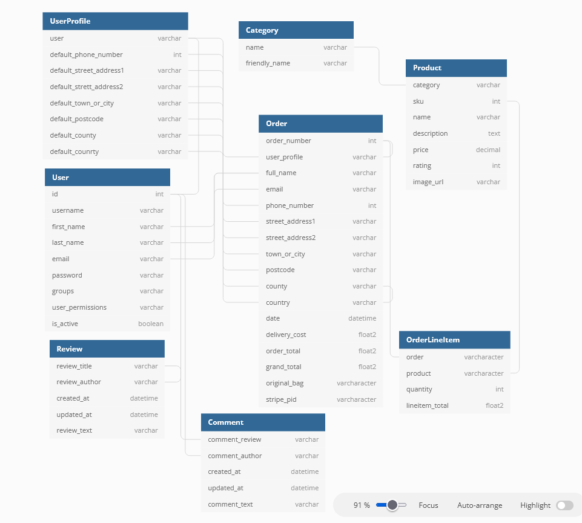
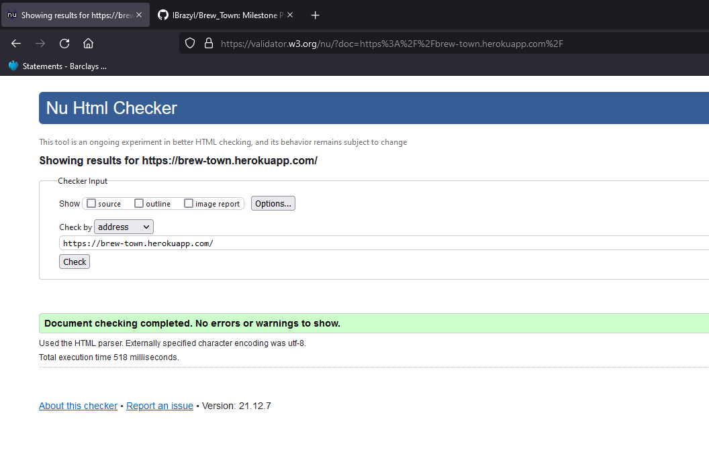
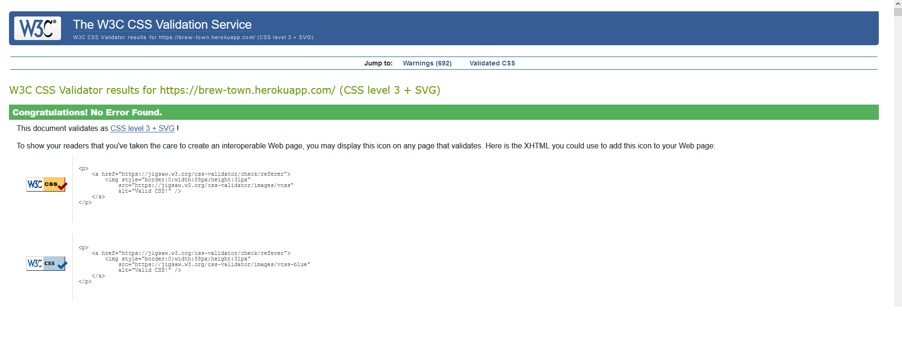

# Brewtown (Milestone Project 4)

[Visit My Site Here](https://brew-town.herokuapp.com/)

## Overview
Brewtown is an e-commerce site dedicated to the selling of tea and coffee. With a simple layout and easy navigation, it is designed to let the products do the talking,
with very little input needed from the user to get what they want.

## Table of Contents

[UX](#ux)

[Features](#features)

[Technologies Used](#technologies)

[Testing](#testing)

[Deployment](#deployment)

[Credits](#credits)

## UX
### User Stories
#### A First Time Visitor
- I want to be able to navigate the site easily and understand what it is for.
- I want to be able to browse for products I would like to buy.
- I want to be able to buy products without logging in.
- I want to see a wide range of products displayed in an easy-to-see format.
- I want the site to work on all screen sizes, depending on what device I use.

#### A Returning User
- I want to be able to login to the site and see what I have previously ordered.
- I want to be able to find the products I like quickly with a search function.
- I want to be able to leave a review of the company, products and my customer experience.
- I want to be able to access the company's social media to share with my friends and family.

### Strategy
- The aim of the site is to be an e-commerce store which is easy to access and use. 
- The site allows users to purchase items, log into their own account and leave comments.

### Scope
- Provide an easy to navigate, easy to use e-commmerce site.
- Allow users to search for specific products within the database, and search specific types of products.
- Provide users a space to add their feedback to the website/products.

### Structure
#### Interaction Design
- Create a website that is responsive, works at all screen sizes and has mobile, tablet and PC compatibility.
- Allow for easy navigation between pages of the website.
- Create easy to use and understand forms for users to fill in.
- Create a UI that is easy on the eye.

#### Information Architecture
- Create a products page that has clear distinctions between products.
- Content is spaced well and easy to read.
- Forms are created in a such a way that they are logical and not confusing, even to first time users.

### Skeleton
#### Wireframes

 
 
 

#### Information Design
- Information boxes within the home page are large, well spaced with clear text.
- The footer is split into 3 clear sections.
- Product cards are informative, simple and contain all information the user will require.
- Product details are enhanced and clearer when a singular product is visible.

#### Interface Design
- All buttons and nav elements share the same design for consistancy and balance.
- The site UI is basic and un-cluttered leading to easy content reading.

#### Navigation Design
- Navigation links are based at the top of the page, this remains the same for all pages of the site.
- Any links that are within the site are well labeled. 

### Surface
#### Typography
Two different fonts have been selected for use on this site. Both fonts have been obtained from [Google Fonts](https://fonts.google.com/).
- Dosis: This has been used for all headings, a quirky font that stands out and really fits the aesthetic of the site. Designed to be modern. 
- Bitter: Used for the rest of the content on the page, clean and easy to read.

## Features
#### Existing Features
- The Brewtown e-commerce site is made using the python framework Django: a large and feature-rich framework.
- The site features django auth features such as login and account creation. When a user creates an account, they receive an automatic email to verify their email address.
- The main page of the site is the 'products' page. Here, the user can see all products within the PostgreSQL databse.
- The site maintainer can add more products to the site either using the admin page (provided by django) or by using the product management page.
- The site maintainer can also edit and delete products by selecting the options from within the product page. 
- Payments for the products are all handled using stripe, which has its own section of the checkout page
- Users have the option to select pre selected searchers with navigation elements. They can also use the search bar to select them within the title or the product description.
- Users with an account have the ability to see their previous orders and update their shipping information.
- Users and site maintainers can interact using the reviews system. The maintainers can post messages where the users can comment and share their thoughts.
- Boostrap toasts are used to display messages.

#### Features Left to Implement
- Implementation of a subscription service also using stripe.
- Saved products within the user profile.
- Other payment options.
- Working, user defined star rating for products.

### Data Schema

#### Models

##### User
- The User model comes in-build within the django framework and is used for most of the authentication within the site.
- The model is passed to the UserProfile model where their user information can be updated and saved for faster checkout upon repeat purchases.
- User is also passed to the Review and Comment models where it is used to display who has posted the review or comment, also allowing the user who has created
the Review or comment to edit or delete that item.
- The User is also used within the order model, where is allocated that specific order keeping each separate order assigned to its respective User.

##### Order
- The Order model is used to store the information of both the users details, users postal address and also the charges that will be used by stripe to take the payment.
- The Order will take the Users information which is then stored within the UserProfile model for quicker purchasing next time.

##### OrderLineItem
- OrderLineItem is used to pass information to the Order model
- It has the key infromation like what the product is, how many of that product are required and the price.
- Each of these OrderLineItems are then sent to the Order and used to calculate the totals.

##### UserProfile
- The UserProfile model will originally store the information from the Order model to allow for faster checkout when a user returns to the site.
- The User Profile can also be updated without and order. Where the user can update their shipping details.

##### Review
- Reviews are simple posts that can be created by the admin or by a logged in user.
- Reviews use the User model, where there saved to the User who has created them, this is then displayed within the reviews page of the site

##### Comments
- Comments are directley related to the Reviews, without a Review their can be no comments.
- Comments are assigned to a review, where they will display when that Review is view on the site.
- Comments also take information from the User model, where each comment is created by a User.

##### Category
- Category modlels only have two fields name and friendly_name.
- name is used by the products model to assign each product a category which is used for sorting and searching.
- friendly_name is used to display a more readable name for users of the site.

##### Product
- The product model is the most seen model within the site. It has the most direct interaction with users and contains all the information needed by site users.
- Each product has its own SKU which works the same as a personal id, each product is indvidual.
- Name and description and image are all used on the main products pages, to encoruage the user to purchase the products. 
- Price will be sent to the order when the user decides to checkout, this will be used to calculate what the customer will be charged.

## Technologies Used

### Languages
- Python/Django - Used to create all functionality of the site, all pages are rendered using django.
- PostgreSQL - Used for the site database.
- HTML- Used for the bulk of the site, using django's templating langusge to render database items.
- CSS- Mostly used in conjunction with the Boostrap CSS library to style and structure all the pages.

### Programs
- Git Pod: Used as a code editor. This was used as it's workspaces are in their own virtual environments.
    Also has the same structure as VS Code.
- Balsamic: Used to create wireframes.
- Heroku: Used to deploy the site for public use.
- Git Hub: Used to host the websites repository.
- [HTML Validator](https://validator.w3.org/) - Used to check HTML code for errors.
- [CSS Validator](https://jigsaw.w3.org/css-validator/) - Used to check CSS code for errors.
- [Python Validator](https://extendsclass.com/python-tester.html) - Used to check Python code for errors.

## Testing
- Code Validators- 
- HTML 
- CSS 
- Using test.py to test functions made within python ensuring correct outputs.

### Home
- All nav links working as intended.
- Nav links look good on all screen sizes.
- Search bar works, displaying all queried items.

### Products
- Products all displaying with correct images. 
- Selecting category searches for other items within the category. 
- Quantity buttons work as intended, when items added to bag the price is respecitve of the quantity.
- Add to bag link works, displaying in the top right hand corner and with toasts.

### Shopping Bag
- Upon empty shopping bag, offers to return user to products page.
- Information displays well and respecitve to what the user has added to the bag.
- Delete button works as intended, removing item from bag.
- All the totals are working correctly and displaying the correct amounts.
- Checkout button starts the checkout process.

### Checkout
- All products loaded into bag show up as intended.
- User cannot avoid completing the required datafields.
- Users data is saved for use on next purchase.
- Adjuct bag correctly takes the user back to the bag.
- Stripe section working and linked. 
- Upon completion user is redirected to their order summary.

### Profile
- If the user has not already completed an order, no orders show as intended.
- User can always update their shipping details and these are then updated in the database.

### Reviews
- Reviews are displayed in the correct format.
- Reviews display the title and some of the content but must be clicked to fully access.
- Comments are shown beneath their respecive review.
- User comment form looks good and submits correctly.

## Bugs
### General
- Issues linking product images from databse to main site.
- Navigations links search criteria not working as intended.
- Naming and syntax errors when writing views and urls.
- Linking stripe payments to the checkout page.
- Subtotals not displaying as intended.
- Quanity of items within bag not displaying and in integer.

### Devices
- Galaxy S9: Works as intended.
- Galaxy S20: Works as intended.
- I phone 6: Works as intended.
- I phone 11: Works as intended.
- I Pad:  Works as intended.
- Small screen laptop: Works as intended.
- Large screen laptop: Works as intended.
- Desktop:  Works as intended.

### Browsers 
- Firefox: Working as intended, no errors.
- Microsoft Edge: Working as intended, no errors.
- Chrome: Working as intended, no errors.
- Safari: Working as intended, no errors.

## Deployment

### Deployment to GitHub
1. Opened GitHub Desktop and selected "New Repository".
2. Gave the project name "Brew-town" and clicked "Create Repository".
3. Opened the repository in GitPod.
4. Created index.html and README.md pages.
5. Opened up local terminal and "Git Added" both pages.
6. Committed both pages using "Git Commit".
7. Pushed changed with "Git Push" adding my work to my Git Hub page.
8. Opened my GitHub page to see the changes.

### How to fork the project
1. Select repository you wish to fork.
2. On the top right corner of the page select 'fork'.
3. Navigate to your fork of the selected repository.
4. To clone the repository using HTTPS, click "Clone with HTTPS".
5. To clone the repository using an SSH key click Use SSH, then click.
6. To clone a repository using GitHub CLI, click Use GitHub CLI, then click the clipboard icon for copying the URL to clone a repository.
7. Open Git Bash. Change directories to the location of the fork you cloned.
8. Type git remote -v and press Enter. You'll see the current configured remote repository for your fork.

### Deployment to Heroku
1. Created account on heroku.
2. On the right hand side of the screen selected 'new' drop down menu then selected 'create new app'.
3. Entered an app name and selected create app.
4. Selected Connect to git hub.
5. Entered the name of the repo from GitHub I wanted to use.
6. Once linked to git hub selected 'settings'.
7. Selected 'reveal config vars'.
8. On the config vars menu added all my environment variables including secret key.
9. Selected 'deploy' from menu and enabled automatic deploys.
10. Site automatically deploys when new code is pushed up to GitHub.
11. Selected 'open app' in the top right corner to view live site.

## Credits
### Technical
- Google Fonts: Used for both fonts within the site.
- Font awesome: Used for all icons within the site.
- Django documention: In-depth explanations about django processes.
- dbdiagram.io: Used to create the data schema. 
### Images
- 
    Used for home page background image.
- 
    Used for all tea and coffee images.
 ### Acknowledgements
- Code Institute - Running the course and providing this opportunity. 
- Code Institute Botique Ado: Used heavily for guidance on both django and stripe functionality.
- Mentor, Spencer - Reviewing my work and helping with technical problems.
- Slack Community - Peer reviewing my work. 
